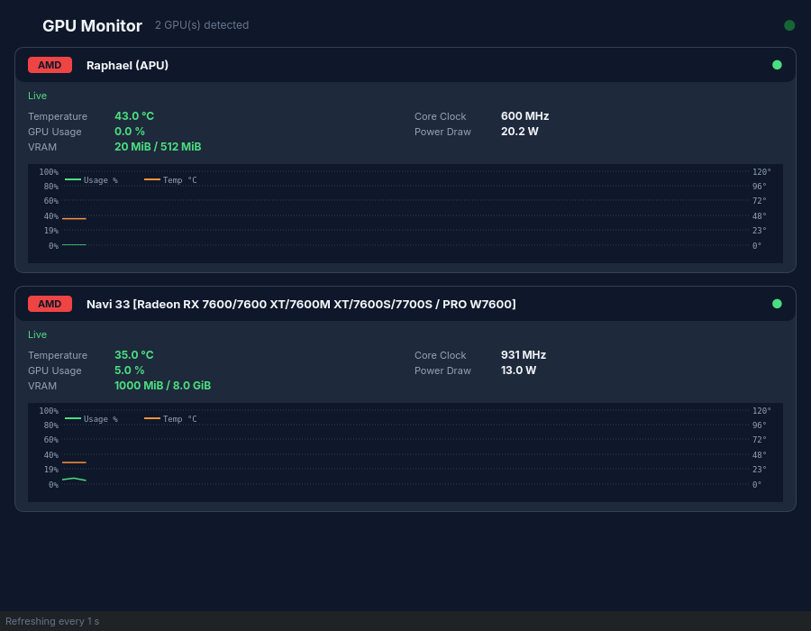

# GPU Monitor

Monitor de GPU multi-fabricante en tiempo real (Python + PySide6). Detecta
automáticamente todas las GPUs del sistema —dedicadas e integradas, AMD,
NVIDIA e Intel— y muestra sus métricas en vivo sin depender de herramientas
propietarias de cada fabricante.

## Por qué

Las herramientas de monitoreo de GPU suelen estar atadas a un solo
fabricante. Esta app usa una arquitectura de backends intercambiables
(`GPUBackend`) para normalizar los datos de AMD, NVIDIA e Intel bajo una
misma interfaz, sin inventar valores cuando un fabricante no expone una
métrica (devuelve `None`, nunca `0` falso).

## Fuentes de datos por fabricante

| Fabricante | Fuente | Limitaciones |
|---|---|---|
| AMD | sysfs de `amdgpu` (`/sys/class/drm/card*/device/`) | Ninguna, cobertura completa |
| NVIDIA | `pynvml` (o `nvidia-smi` como fallback) | Requiere driver propietario |
| Intel | sysfs de `i915`/`xe` | Sin uso % ni VRAM — no expuesto por el driver |

## Instalación

\`\`\`bash
pip install -e .
python3 main.py
\`\`\`

## Tests

\`\`\`bash
pytest -v
\`\`\`

72 tests cubriendo parseo de sysfs, detección de hardware, deduplicación de
GPUs NVIDIA y manejo de errores por panel sin crashear la app completa.
